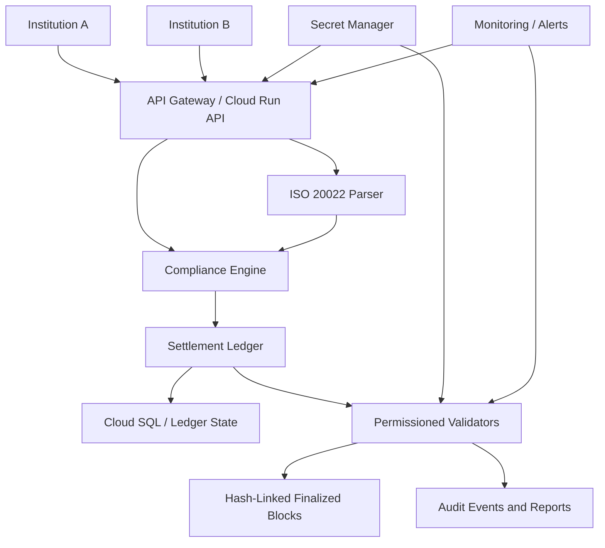
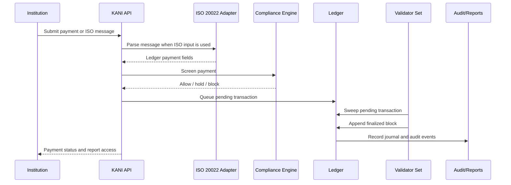
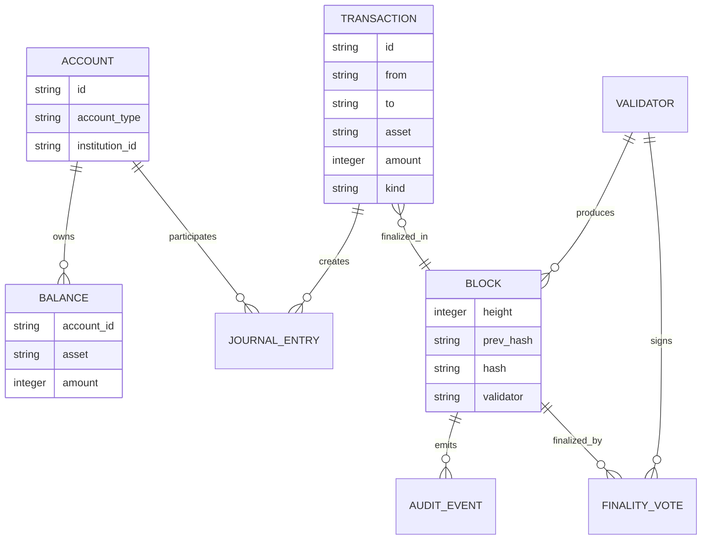
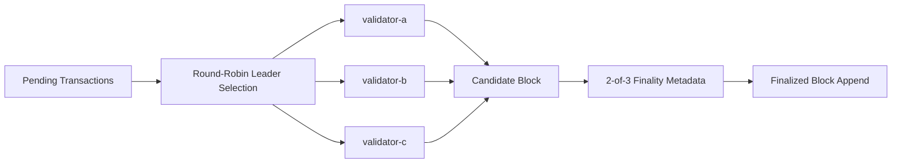
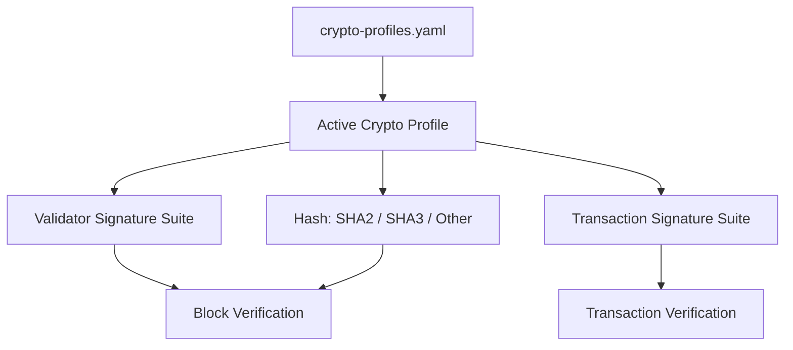
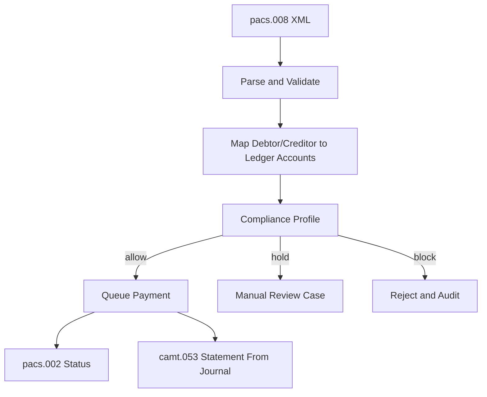
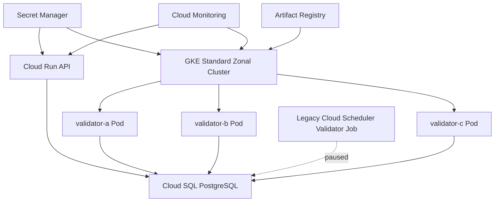
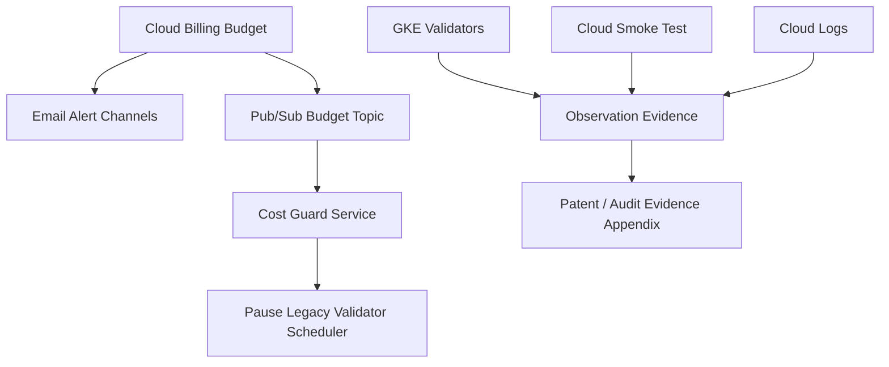

# Figure Set For Provisional Patent Draft

These figures are engineering diagrams for counsel to redraw or file as informal provisional drawings if appropriate.

## Figure 1: Private Settlement Network Architecture

## Figure 2: Payment-To-Finality Flow

## Figure 3: Ledger And Block Data Model

## Figure 4: PoA Validator Finality

## Figure 5: Crypto-Agile Profile Selection

## Figure 6: ISO 20022 And Compliance Gating

## Figure 7: Cloud-Native Sandbox With GKE Validators

## Figure 8: Budget Guardrail And Observation Evidence

